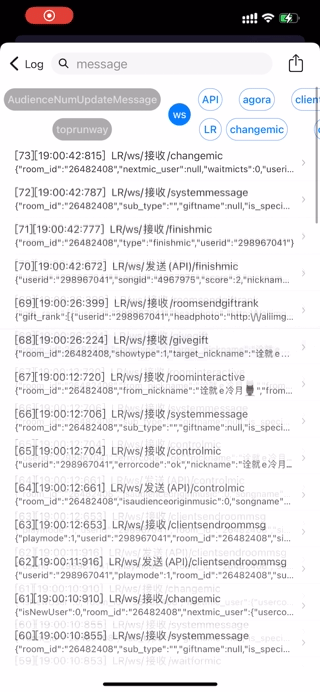
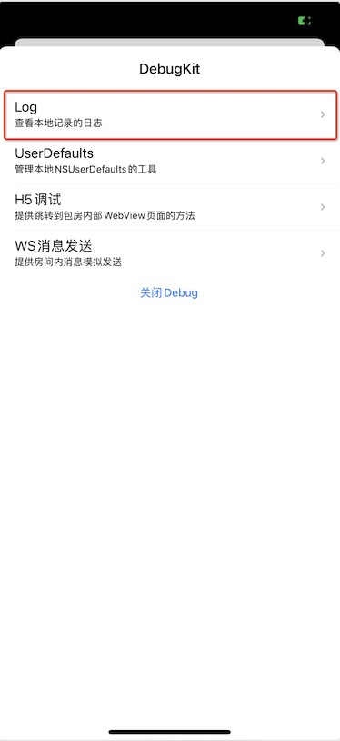

# DebugKit

[](https://travis-ci.org/iyinghui@163.com/DebugKit)
[](https://cocoapods.org/pods/DebugKit)
[](https://cocoapods.org/pods/DebugKit)
[](https://cocoapods.org/pods/DebugKit)

方便调试的工具箱

## 功能组件

- DebugKit/Core：核心类，核心类里面包含ToolBox的UI、动态添加工具、Toast、QRView、系统的分享便利方法等便利方法
- DebugKit/Log：log记录工具
- DebugKit/FileLogViewer：log查看工具，具有关键字过滤，关键字排除，内容搜索，文件分享
- DebugKit/JsonViewer：Json查看工具，json里面的链接支持点击，图片链接查看，MP3/MP4播放等功能
- DebugKit/UserDefaults：UserDefaults操作工具，支持UserDefaults搜索，删除
- DebugKit/MsgSimulation：消息模拟发送工具
- DebugKit/H5Portal：WebViewController传送门工具

## 工具

### DKLog

功能完善的日志持久化记录与查看工具

- 工具组成

  整个日志工具有`DebugKit/Core`、`DebugKit/Log`、`DebugKit/JsonViewer`、`DebugKit/FileLogViewer`模块组成

- 功能介绍



  

- 接入

  1. 在podfile引入依赖

     ```ruby
     # podfile
     
     # log查看工具
     pod 'DebugKit/FileLogViewer', :git => 'git@gitlab.changbaops.com:wangyinghui/DebugKit.git', :configurations => ['Debug']
     ```

  2. 打开DebugKit入口

     ```swift
     // ...
     #ifdef DEBUG
     import DebugKit
     #endif
     
     // ...
     
     #ifdef DEBUG  
     // 打开DebugKit入口
     DebugKit.share.openDebug()
     #endif
     
     // ...
     
     ```

  3. 需要埋入日志

     ```swift
     // ...
     #ifdef DEBUG
     import DebugKit
     #endif
     
     // ...
     
     #ifdef DEBUG  
     /// 添加一条日志
     /// - Parameters:
     ///   - keyword: 关键词，方便查询搜索，多个关键词可以采用 “keyword1/keyword2”
     ///   - message: 日志详情
     DKLog.share.log(keyword: "关键字", message: "日志内容")
     #endif
     
     // ...
     
     
     ```

     4. DebugKit页面就会显示其入口

        

### H5Portal

WebViewController传送门工具

1. 在podfile引入依赖

   ```ruby
   # podfile
   
   # WebViewController传送门工具
   pod 'DebugKit/H5Portal', :git => 'git@gitlab.changbaops.com:wangyinghui/DebugKit.git', :configurations => ['Debug']
   ```

2. 打开DebugKit入口

   ```swift
   // ...
   #ifdef DEBUG
   import DebugKit
   #endif
   
   // ...
   
   #ifdef DEBUG  
   // 打开DebugKit入口
   DebugKit.share.openDebug()
   #endif
   
   // ...
   
   ```

3.  DebugKit页面就会显示此工具入口

   

### DKUserDefaults

管理本地NSUserDefaults的工具

1. 在podfile引入依赖

   ```ruby
   # podfile
   
   # 管理本地NSUserDefaults的工具
   pod 'DebugKit/UserDefaults', :git => 'git@gitlab.changbaops.com:wangyinghui/DebugKit.git', :configurations => ['Debug']
   ```

2. 打开DebugKit入口

   ```swift
   // ...
   #ifdef DEBUG
   import DebugKit
   #endif
   
   // ...
   
   #ifdef DEBUG  
   // 打开DebugKit入口
   DebugKit.share.openDebug()
   #endif
   
   // ...
   
   ```

3.   DebugKit页面就会显示此工具入口

   

### MsgSimulation

消息模拟发送工具

1. 在podfile引入依赖

   ```ruby
   # podfile
   
   # 消息模拟发送工具
   pod 'DebugKit/MsgSimulation', :git => 'git@gitlab.changbaops.com:wangyinghui/DebugKit.git', :configurations => ['Debug']
   ```

2. 打开DebugKit入口

   ```swift
   // ...
   #ifdef DEBUG
   import DebugKit
   #endif
   
   // ...
   
   #ifdef DEBUG  
   // 打开DebugKit入口
   DebugKit.share.openDebug()
   #endif
   
   // ...
   
   ```

3.   DebugKit页面就会显示此工具入口

   

## Example

To run the example project, clone the repo, and run `pod install` from the Example directory first.

## 要求

最低支持系统版本iOS10

## Installation

DebugKit is available through [CocoaPods](https://cocoapods.org). To install
it, simply add the following line to your Podfile:

```ruby
# podfile
debugKitGit = 'git@gitlab.changbaops.com:wangyinghui/DebugKit.git'
pod 'DebugKit/Core', :git => debugKitGit, :configurations => ['Debug'] # 核心类
pod 'DebugKit/Log', :git => debugKitGit, :configurations => ['Debug'] # log记录工具
pod 'DebugKit/FileLogViewer', :git => debugKitGit, :configurations => ['Debug'] # log查看工具
pod 'DebugKit/JsonViewer', :git => debugKitGit, :configurations => ['Debug'] # Json展示ViewController
pod 'DebugKit/UserDefaults', :git => debugKitGit, :configurations => ['Debug'] # UserDefaults操作工具
pod 'DebugKit/MsgSimulation', :git => debugKitGit, :configurations => ['Debug'] # 消息模拟发送工具
```

## Author

wangyinghui@changba.com

## License

DebugKit is available under the MIT license. See the LICENSE file for more info.
